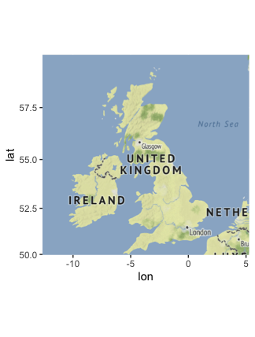
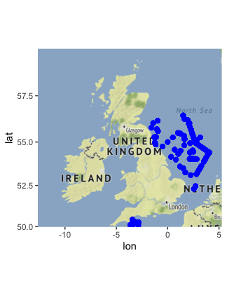
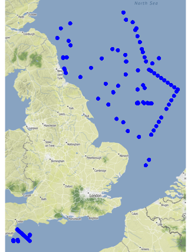
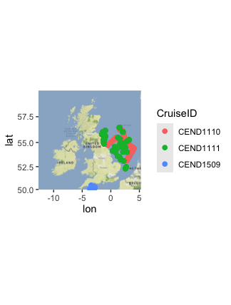
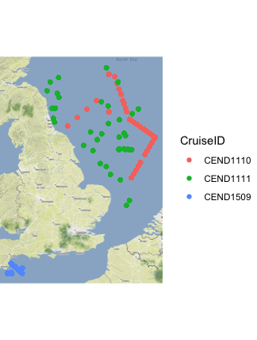
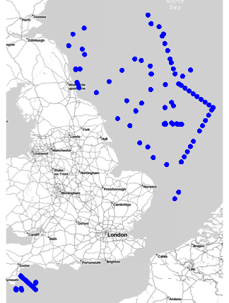
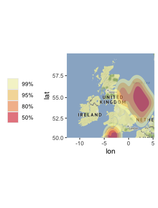

### Tutorial Aims

#### <a href="#section1"> 1. Setting Up Stadia Maps</a>

#### <a href="#section2"> 2. Creating Point Locations on a Map</a>

#### <a href="#section3"> 3. Mapping statistics</a>

Introduction to GGMAP
---------------------------

In this tutorial we will go over the basics of using the r package ggmap and different syntaxes used to create maps. We are using Stadia maps as the source of our maps today and 
the first section goes over how to register Stadia Maps in r

You can get all of the resources for this tutorial from <a href="https://github.com/EdDataScienceEES/tutorial-Sofianker.git" target="_blank">this GitHub repository</a>. Clone and download the repo as a zip file, then unzip it.

<a name="section1"></a>

## 1. Setting Up Stadia Maps

Stadia Maps acquired the free map data base stamen maps recently, so in order to use their maps we have to create an API key in stadiamaps and register it in r. To do this you should first 
create an account at stadia maps. After doing so you will want to create a property. Name it something relevant to your project for now just call it tutorial. On the property page there is a 
button to create API key. When clicked it will show a long string of letters and numbers copy that into your clipboard and head over to R. 
```r
register_stadiamaps("Your Key Here", write = FALSE)
```
Now we can use `get_stadiamaps` in r to create maps!


<a name="section2"></a>

## 2. Creating Point Locations on a Map

### Downloading Data 
We will be using a data set from the Centre Environment, Fisheries, and Aquaculture Science of the sampling locations from a project where the seabed was sampled. The data set can be found in 
the github repository linked above. To learn how to sync github with r refer to <a href="https://ourcodingclub.github.io/tutorials/git/index.html" target="_blank">the Git Tutorial</a>. 
Start a new r script by clicking `File/New File/R Script`. Start the script by copying the code below!
```r
#Load Libraries----
library(tidyverse)
library(ggmap)
library(ggplot2)
library(forcats)
library(patchwork)
library(ggdensity)
library(RColorBrewer)
#Load Data
#Can be found in repository
North_Sea<-read_csv("FILE PATH AND FILE NAME.csv")
str(North_Sea)
```
### Mapping 
To get a map of our area of interest we first need to define the coordinates it is within. We create an object of the list of longitude and latitude that contain the box of our map. To find the coordinates 
for any box on a map <a href="http://bboxfinder.com/#0.000000,0.000000,0.000000,0.000000" target="_blank">this website</a> is very helpful. After creating the object we then use the function 
`get_stadiamap` with the syntax `(bbox=your coordinates from before, zoom= 5, maptype= "the style of map you want")` you can find all of the styles of map available by running  
`?get_stadiamap`. The zoom of your map depends on how big of an area you created with your coordinate box. If you pick too high of an area and too high of a zoom it can sometimes take a while to run and may tell you to pick a lower zoom.
To then produce your map you use `ggmap("your map name")`
```r
bbox<- c(-12.650070,49.968448,5.279617,59.880324) #define the coordinates of the box surrounding the UK 
map<-get_stadiamap(bbox = bbox, zoom=5, maptype = "stamen_terrain")
ggmap(map)
```


We will continue to build off of this map. Like ggplot, <a href="https://ourcodingclub.github.io/tutorials/datavis/" target="_blank">which you can learn about here</a> , ggmaps have layers (like ogres and onions). One of the ways we can plot points onto our map is by using geom_point as a layer in our ggmap. The first bit is the same code that we made our basic map of the UK with. We then pipe and tell it we want to plot points from our data set. The syntax is the same as if you were plotting a `geom_point` graph in ggplot
```r
get_stadiamap(bbox, zoom = 5, maptype = "stamen_terrain") %>% ggmap() +
  geom_point(aes(x = DecLon84, y = DecLat84), data = North_Sea, colour = "blue", size = 2)
```


Another option to produce a similar map with a little less text is to use qmplot from the ggmap package. With this option you don't need to manually add your bbox as it chooses a zoom and coordinates for you. 
```r
qmplot(DecLon84, DecLat84, data = North_Sea, maptype = "stamen_terrain", color = I("blue"))
```


This is a bit clearer as we are zoomed in nicely onto the map. However, if you tried different options for your zoom and bbox with the `geom_point` map you could get the same result. 

These samples were taken by 3 different cruises. What if we wanted to show which cruises took which samples. We would simply add in the `aes()` that we want to color by the variable CruiseID from our data set. 
```r
get_stadiamap(bbox, zoom = 5, maptype = "stamen_terrain") %>% ggmap() +
  geom_point(aes(x = DecLon84, y = DecLat84, colour = CruiseID), data = North_Sea, size = 2)
```
or in the qmplot instead of `I("your color")` you would just write the variable CruiseID
```r
qmplot(DecLon84, DecLat84, data = North_Sea, maptype = "stamen_terrain", color = CruiseID)
```

geom point map with cruises 


qmplot map with cruises 

Now if we were plotting something that was not about the environment, let's say government buildings across the UK, we might want a different style map than `stamen_terrain` .  `stamen_toner` or `stamen_toner_lite` both provide a map that would be more useful in these situations. 
```r
qmplot(DecLon84, DecLat84, data = North_Sea, maptype = "stamen_toner_lite", color = I("blue"))
```


<a name="section3"></a>

## 3. Mapping Statistics 

While this map looks great it might be a bit overwhelming with all of the points. What if I wanted to just visualize where most of my sampling points were. We need to call back to the map of the UK we made at the beggining of this tutorial. We then add a layer using the function geom_hdr which maps density estimations. We use similar syntax to our geom_point but this time the fill equals the probability of a point being in that area. We can choose whatever color palette we want from the brewer but for our purposes the red and orange seemed to be signify density. To see all of the palette options simply run `display.brewer.all()`
```r
(hdr_map <- ggmap(map) + 
    geom_hdr(
      aes(DecLon84, DecLat84, fill = after_stat(probs)), data = North_Sea,
      alpha = .5
    ) +
    scale_fill_brewer(palette = "YlOrRd") +
    theme(legend.position = "left"))
```


This gives us a nice visualisation of the area we sampled 

I hope this tutorial helped you make some beautiful maps and helped you get familiar with ggmap. To summarise in this tutorial we learned

##### - how to set up a stadiamap account and register a key
##### - how to create ggmaps and plot data points
##### - some of the different plot methods in ggplot2

We can also provide some useful links, include a contact form and a way to send feedback.

For more on `ggplot2`, read the official <a href="https://www.rstudio.com/wp-content/uploads/2015/03/ggplot2-cheatsheet.pdf" target="_blank">ggplot2 cheatsheet</a>.

Everything below this is footer material - text and links that appears at the end of all of your tutorials.

<hr>
<hr>

#### Check out our <a href="https://ourcodingclub.github.io/links/" target="_blank">Useful links</a> page where you can find loads of guides and cheatsheets.

#### If you have any questions about completing this tutorial, please contact us on ourcodingclub@gmail.com

#### <a href="INSERT_SURVEY_LINK" target="_blank">We would love to hear your feedback on the tutorial, whether you did it in the classroom or online!</a>

<ul class="social-icons">
	<li>
		<h3>
			<a href="https://twitter.com/our_codingclub" target="_blank">&nbsp;Follow our coding adventures on Twitter! <i class="fa fa-twitter"></i></a>
		</h3>
	</li>
</ul>

### &nbsp;&nbsp;Subscribe to our mailing list:
<div class="container">
	<div class="block">
        <!-- subscribe form start -->
		<div class="form-group">
			<form action="https://getsimpleform.com/messages?form_api_token=de1ba2f2f947822946fb6e835437ec78" method="post">
			<div class="form-group">
				<input type='text' class="form-control" name='Email' placeholder="Email" required/>
			</div>
			<div>
                        	<button class="btn btn-default" type='submit'>Subscribe</button>
                    	</div>
                	</form>
		</div>
	</div>
</div>
